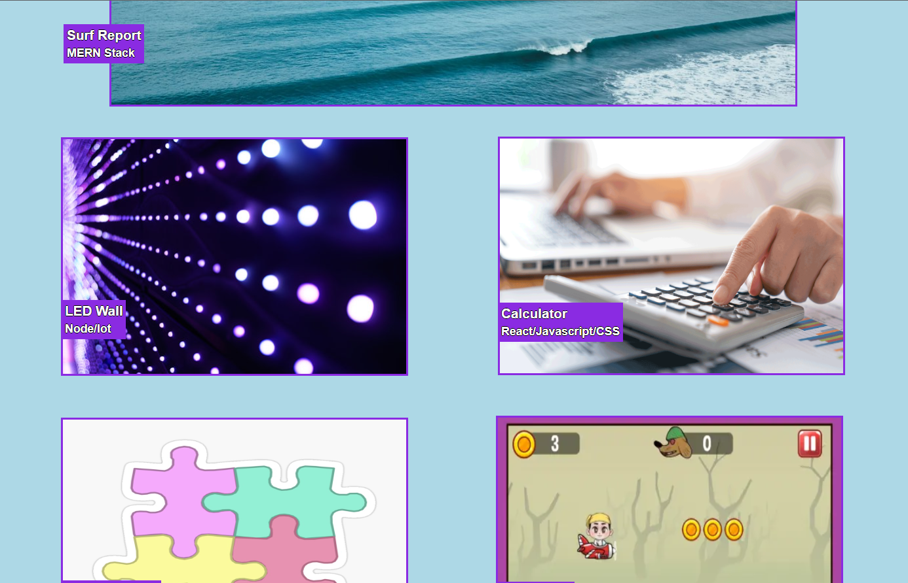

# k-professional-portfolio-code

I'm using both HTML & CSS to make this Professional Portfolio website. 

The user wants a header with the proper CSS included.

The user wants a navbar that includes "About Me, Work, Contact Me & Resume".

The user wants a "Subtitle" section after the navbar.

The user wants a "About Me" section with a semi detailed description about myself.

The user wants a "Work" section with a "Surf Report, LED Wall, Calculator, Pastel Puzzles & Run Buddy" that represents the code that I know.

Images on the website need an animation when the user hovers over it (Hover animation)

The user wants a footer with a "Contact Me" with a phone number, email, github and socials.

Links:
https://github.com/kitkatt17/k-professional-portfolio-code

https://kitkatt17.github.io/k-professional-portfolio-code/

